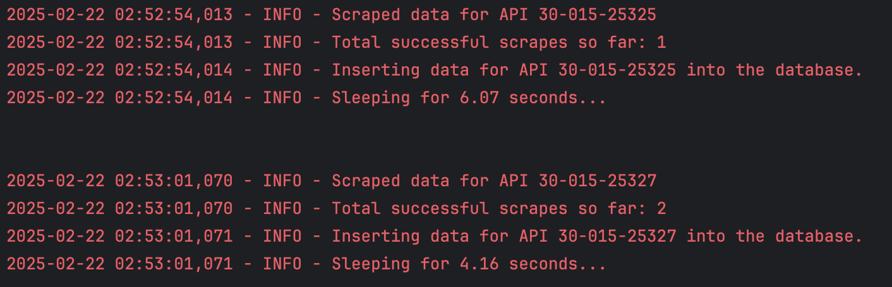
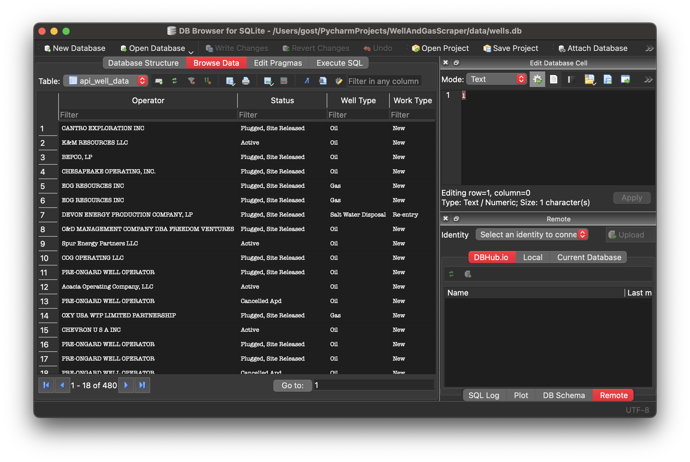

# Well Data Scraper and API

This project provides a solution for scraping well data based on API numbers, inserting the scraped data into a database, and serving the data through a Flask API.

**NOTE:** Does not use multithreading yet. I figured I would rather just get the job done than deal with balancing throttling and multithread. 

## Project Overview

Uses python 3.12.0

I have included my PostMan collection to test the api also.

The project is broken down into three main components:

1. **Scraping Well Data**: The scraper fetches detailed well information from a public website for a list of API numbers.
2. **Database Insertion**: The scraped data is inserted into a SQLite database for easy retrieval and further processing.
3. **Flask API**: A Flask application serves as an API to query well data based on API numbers and geospatial polygons.

## Features

- Scraping well data, including operator, status, well type, and geospatial coordinates.
- Inserting the scraped data into a database.
- Avoiding throttling by introducing randomized sleep times between requests.
- Exposing well data via a Flask API.
- Retry mechanism to handle request failures during scraping.
- Nice clean logging as shown below:

## The Code

- The main.py class is like a regular main driver class that calls other class methods to scrape the data and load it into the db file
- The app.py must be run after the above file once the scraping is done to start the flask API which you can then test with the PostMan collection I included too

note: APIsInsideGivenPolygon.txt contains the apis inside the requested polygon.

You can also use SQLite DB Browser (its free) to check the data in the db file. Itll look like this:

